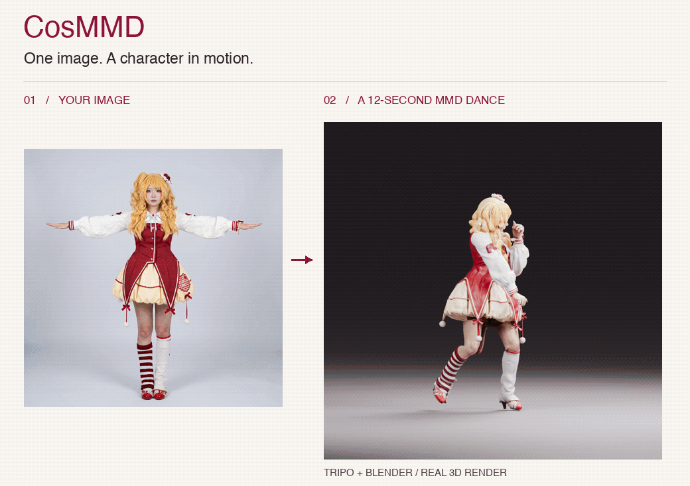
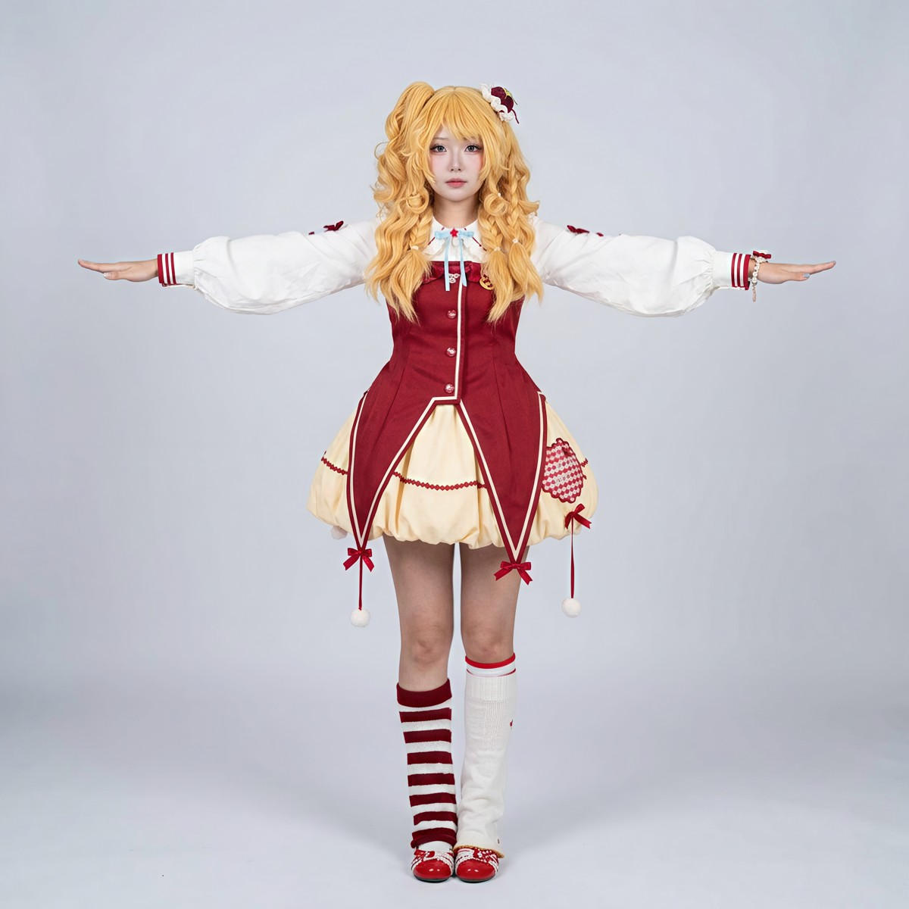
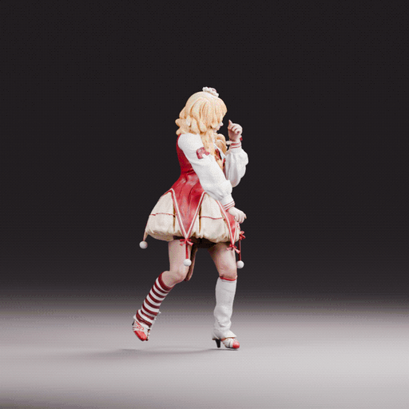

<div align="center">

# CosMMD

### One image. A character in motion.
### 仅凭一张角色图片，让 3D 角色跳起 MMD！

**Single-image cosplay → textured 3D → articulated rig → a 12-second dance.**

[](LICENSE)
[](https://www.blender.org/)
[](#what-you-get)
[](https://github.com/CyclopsRay/CosMMD/actions/workflows/ci.yml)



**One character reference · 104 rig bones · 30 finger bones · 12 seconds in motion**

[English](#what-you-get) · [中文](#中文说明) · [Get the agent skill](https://github.com/CyclopsRay/2DCosplayerToMMD) · [Workflow & lessons](docs/workflow.md)

</div>

Your character already has a look. **CosMMD carries that look into motion**: the
hair, outfit, cuffs, fingers, shoes and small details that make the character yours.
Tripo builds the 3D starting point. Blender supplies the rig, motion and rendering.
CosMMD packages the glue, the repair recipes, and the checks we wish we had on day one.

**Like the transformation? Star CosMMD and help build the next chapter of single-image character animation.**

## What you get

- **A Tripo API workflow** for one image → textured GLB → humanoid auto-rig, with task checkpoints and no blind paid retries.
- **Appearance-preserving rig tools**: transfer weights to the original surface, fit finger chains, calibrate the neutral pose, and constrain knee bends.
- **An MMD import bridge** for a locally supplied, licensed VMD through external MMD Tools.
- **A robust rendering path**: a fresh Blender process per frame, resumable output, every-frame scans, and GIF generation.
- **The actual reference-character recipes**, plus a detailed failure notebook covering swapped legs, misplaced elbows, unnecessary reconstruction, and black render artifacts.
- **A companion agent skill** that guides the full process and keeps geometry-specific decisions explicit.

This is an **early, agent-guided toolkit**, not a universal one-click auto-rigger.
The only character input is one full-body image; you also need a Tripo API key,
Blender, and a motion you are allowed to use. Calibration is still necessary for
complex garments and generated topology. The input image does not generate the dance choreography.

## Start here

Python 3.10+; the Blender workers were exercised with Blender 5.2.1 on Apple Silicon.
CPU rendering is the portable default. Other operating systems/GPU backends are
configurable but have not been verified in this showcase.

```sh
git clone https://github.com/CyclopsRay/CosMMD.git
cd CosMMD
python -m venv .venv
# Activate the environment for your shell, then:
python -m pip install .

# Dry run: no upload, no API credit use.
cosmmd generate --image private/reference.png --run private/my-character

# Set TRIPO_API_KEY privately, then explicitly submit paid tasks:
cosmmd generate --image private/reference.png --run private/my-character --execute
```

**Then follow [the workflow](docs/workflow.md)** to inspect the generated mesh,
calibrate the skeleton, import a licensed motion, and export your clip. For an
agent-led session, install [2DCosplayerToMMD](https://github.com/CyclopsRay/2DCosplayerToMMD).
There is deliberately no automatic “repair everything” step that silently replaces your character's hands or costume.

Already have a model in Tripo Studio? Export the source and rigged GLBs locally and
start at inspection. A Studio asset identifier is not necessarily an API task ID.
See [API and reproducibility notes](docs/reproducibility.md).

## The showcase, up close

<table>
<tr><th>One 2D character reference</th><th>12-second Blender / MMD result</th></tr>
<tr>
<td></td>
<td></td>
</tr>
</table>

The GIF contains **180 freshly rendered frames / 12 seconds / approximately 15 fps**.
It is an actual Blender render, not an AI-generated video. The showcase uses an
existing Tripo Studio export and character-specific calibration; the new API adapter
has contract tests, not a newly purchased end-to-end generation benchmark.
A face close-up was available during the original inspection, but is not required
by the packaged single-image workflow. See [provenance and validation](docs/reproducibility.md).

**Still visible:** some hair deformation and skirt/thigh intersections on larger
moves; no facial morphs, lip sync, cloth physics, or audio. The reference recipes
produce editable Blender scenes, not a verified native PMX release.

## What we learned the hard way

| Failure | What changed |
|---|---|
| Left/right leg assignment and knee folds were wrong | Inspect anatomical sides, fit actual joints, use a tested hinge axis and preferred bend |
| Elbows and hands missed the source anatomy | Fit the joints to the mesh; calibrate T-pose → MMD neutral pose before importing rotations |
| Rebuilt hands and shoes lost identity | Restore the original surface, UVs and materials; repair only verified missing/fused areas |
| Fingers looked fused in one view | Inspect topology and multiple views; the source already had separate finger shapes |
| A valid MP4 contained a black character for 16 frames | Scan every frame, compare PNG masters, and rerender from a fresh scene/process |
| Inner-shoe black patches were blamed on seams | Same-model rerenders removed them; separate rendering failures from geometry defects |

The full [failure notebook](docs/pitfalls.md) includes the failed assumptions,
concrete checks, and remaining limitations. These are operational lessons, not a claim
that all future models will behave the same way.

## Build with us

The next wins are better hair/garment separation, automatic landmark proposals,
repeatable multi-character evaluation, native PMX export validation, and fewer
manual calibration steps. Contributions with a reproducible before/after are welcome.
See [CONTRIBUTING](CONTRIBUTING.md).

**Code:** MIT. **Showcase media and third-party assets:** excluded from that license.
No source motion, model, baked animation, audio, or `.blend` file is distributed.
Motion: [つん](https://www.nicovideo.jp/watch/sm28422307);
choreography: [足太ぺんた](https://www.nicovideo.jp/watch/sm27753880);
song: [TOKOTOKO / 西沢さんP](https://www.nicovideo.jp/watch/sm27529228).
[Download at the author's page](https://bowlroll.net/file/96407) ·
[Author terms](https://privatter.net/p/7867947) · [Full credits & media policy](docs/credits.md).

## 中文说明

**给它一张图，让角色走出画面，跳起 MMD。**

CosMMD 把 Tripo 的单图建模、Blender 骨骼校准、MMD 动作导入和渲染整理成一套
可维护的工具与 agent 工作流。重点是保留角色原有的辨识度：发型、衣服、手型、
指甲、袖口、鞋面与袜子细节。

你提供的角色素材只需要 **一张全身图片**，另需 Tripo API 密钥。舞蹈动作需要从
原作者处另行取得并符合使用许可；它不是从图片中生成的。当前版本是需要 agent
或人工校准的早期工具，复杂模型仍不能保证一键完成。

**已经提供：** API 任务断点恢复、原网格权重转移、手指骨骼工具、膝关节约束、
MMD 导入桥接、逐帧独立渲染、黑帧检查、GIF 制作，以及这次角色的完整修复配方。
示例达到 104 根骨骼、30 根手指骨骼与 12 秒舞蹈；头发拉伸、裙摆穿插、表情和
物理模拟仍是下一阶段的改进重点。

上方命令先预览 API 计划，加 `--execute` 才会上传图片并调用付费生成/绑定任务。
模型生成后请按 [完整流程](docs/workflow.md) 校准，或使用配套
[2DCosplayerToMMD skill](https://github.com/CyclopsRay/2DCosplayerToMMD)。
本次展示复用了已有 Tripo Studio 导出，并非新 API 客户端全自动运行的成功率证明。

仓库只发布代码、文档与审核过的展示图片/GIF。模型、动作包、带动作工程、贴图、
音频、API 密钥和运行记录都留在本地。除了 `.gitignore`，还会检查 Git 暂存区和历史。
原作者链接与致谢见 [素材说明](docs/credits.md)。

**如果你也想让一张图里的角色动起来，欢迎 Star CosMMD，分享你有权公开的前后对比，
一起把这个工作流做得更稳、更好用。**
