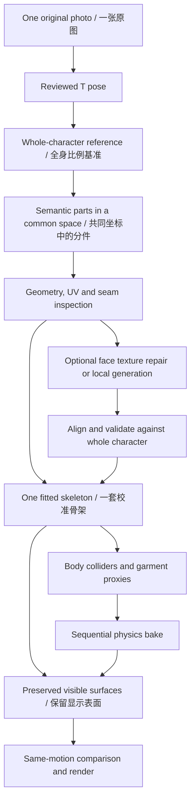

# Part-based character pipeline / 分件角色路线

Status: **architecture decision and local asset inspection, 2026-09-14**.
Segmentation, regional retexturing and cloth adapters below are proposed extensions;
this investigation exported an existing Studio asset and rendered diagnostics. It did
not submit paid generation, replace the dance character, or implement cloth physics.
See [the broader roadmap](technical-roadmap.md) and [current capabilities](reproducibility.md).

## 决策 / Decision

采用 **完整角色基准 → 语义分件 → 共享骨架 → 局部增强 → 独立模拟代理**。
分件是后续衣服/头发模块的接口；不把“头、躯干、腿各自独立生成再拼接”作为默认入口。
当前已分件模型值得作为候选做小样，但先保留现有舞蹈工程作为外观与运动基准。

短期先验证 **脸部对齐 + 单一裙摆区域**。若这份分件模型的轮廓、花纹和连接处通过对照，
将其适配到现有骨架；若退化，只把它作为分区参考，继续从原模型拆出显示表面。
旧骨架与动作可以复用，顶点权重和代理绑定不能不加检查地跨模型复用。

## 当前模型的实际检查 / Observed asset

来源是用户确认的当前 Tripo Studio 分件页面；导出已有 GLB，未执行重生成。
导出文件、哈希、解析报告和 Blender 诊断图留在被忽略的私有运行目录中。

| 项目 | 观察 |
|---|---|
| 网格 / 材质 / 内嵌贴图 | 各 30 个 |
| 三角面 / 导出顶点 | 1,955,536 / 1,019,541 |
| 骨骼蒙皮 | glTF `skins` 为 0，尚未绑定 |
| 坐标 | 部件已处于共同坐标，导出没有保留网页的爆炸分开展示变换 |
| UV | 每个网格都有 UV；30 张 JPEG 贴图，分辨率从 128² 到 2048² |
| 脸部 | 独立部件，26,206 个三角面，对应贴图为 512² |
| 分件边界 | 分析时合并完全同坐标的顶点后，30 件仍都有开放边界 |
| 与旧舞蹈源模型比较 | 旧源为 1,922,921 面；两者原始坐标、顶点集合和贴图像素哈希不同 |

顶点对比以模型单位 `1e-6` 量化；两个文件没有相同的量化位置。这个结果只排除了
“按原坐标原封不动拆开旧源模型”的假设，**不证明发生了肉眼可见的细节损失**。
尚未完成两表面的配准距离测量；生成版本、缩放、重网格化或导出流程都可能造成差异。
贴图哈希不同也不能证明贴图损坏，分件裁切/重打包就会改变哈希。

导出菜单显示的 4K 设置不代表每一个部件都有一张 4K 贴图；局部裁切后的 512²
可能仍保持原始像素密度。要测脸部有效像素密度、投影清晰度和 UV 拉伸，不能只看文件尺寸。

开放边界可能是正常的领口、袖口、裙口或部件切口，并不都需要封口。
另有三个部件在完全同坐标合并的诊断中出现边被两个以上三角面共享，共四条；
重合的独立表面也可能触发此标记，尚未逐处判定，不能据此自动删除几何。
上述检查不构成完整的自交、内衬、隐藏身体或可模拟拓扑验收。

### 脸部错位：已定位到外观与几何的不一致

使用 Blender 5.2.1、同一静态导入模型和相机，分别渲染：

- 原材质加中性灯光；
- 去掉所有原贴图/材质细节的灰色素模；
- base color 接到 Emission，只看纹理外观，排除实时光照阴影。

素模上的鼻底、嘴唇与纯颜色中的对应位置不同；加灯光后出现两组五官轮廓。
**这份资产的问题在绑定与动作之前已经存在。** 尚不能判断错位究竟在生成、纹理投影、
分件或导出哪一步产生，也不能由一个样例推断所有 Tripo 模型必然如此。
关闭灯光只便于诊断，不能作为可重新打光的最终修复。

修复顺序：

1. 对照审核后的 T pose，分别判断几何五官和纹理五官哪个更接近目标。
   保存相同相机的素模、纯颜色、正常材质以及侧面视图。
2. 若几何可用，固定几何，尝试脸部局部纹理重投影/UV 变形，或局部重新贴图；
   以眼角、鼻翼、唇线定位，约束脸部边界，检查侧面拉伸和发际线接缝。
3. 若纹理更接近目标而几何明显错误，先局部拟合几何，再烘焙贴图；
   不把全部误差强行压进 UV，也不全局平移整张人脸纹理。
4. 前述方案不足时，才试高分辨率头部生成，并与全身基准对齐、处理脖颈与发际线。
   只把被验证更好的局部替换进去。一次换头仍不等于完成表情或口腔结构。

## 三条路线的取舍 / Alternatives

| 路线 | 收益 | 主要代价 | 决策 |
|---|---|---|---|
| 在现有舞蹈模型上划分衣服，保留显示表面 | 外观基准、骨架与动作最容易延续 | 需要处理粘连、服装面集、缺失的隐藏面 | 稳妥基线，也是候选失败时的回退 |
| 使用已有 30 件模型，适配同一骨架 | 脸/发/衣/鞋已有可编辑入口；无须立即重新生成 | 必须配准、重新转移权重；分件语义与物理结构不一致 | 优先做局部小样，达标再迁移 |
| T pose 裁成头、身体、腿鞋，独立生成三次或更多 | 可给局部更多生成与纹理预算，便于单独替换 | 独立尺度、比例、姿态、脖颈/袖口接缝、材质色差与重复/缺失表面 | 可选增强分支，先只试头部 |

更多调用不自动带来更多真实细节。裁切能增加该区域在生成输入中的占比，不能从原图中
恢复本不存在的像素；超分辨率和补全会加入推断。三次生成也没有共享人体、关节或边界约束：
即使各自漂亮，头颈粗细、腿长、腰线、手臂方向与皮肤颜色仍可能不一致。

若以后试独立局部生成：保留完整角色作为尺度与轮廓基准；裁图带上邻接区域而非紧贴切断；
记录裁图到 T pose 的二维变换、局部到全身的三维变换、接缝地标与固定边界。
身体、手臂和手不能因为“三段式”名称而遗漏。优先选领口、袖口等遮挡处作为连接位置。
局部模型不单独自动绑成人形骨架，最终统一适配同一骨架。

## 相关方法如何做 / Primary-source research

这些工作说明可借鉴的结构，不构成已经解决本项目复杂 cosplay、准确印花与舞蹈物理的证据。

| 方法 | 实际做法 | 对 CosMMD 的启发与限制 |
|---|---|---|
| [PartCrafter](https://arxiv.org/html/2506.05573v1) | 分部件潜变量结合局部/全局注意力，联合生成；所有部件处于同一个规范坐标空间 | “分部件生成”依靠共享上下文，不等于三次无约束独立调用；未在本角色上验证 |
| [HoloPart](https://github.com/VAST-AI-Research/HoloPart) | 从已有网格及粗分件出发，通过局部与上下文信息补全完整部件 | 区分几何切分与遮挡部分生成；补全可能改变可见形状，不能默认保留原 UV/花纹 |
| [Hunyuan3D-Part](https://github.com/Tencent-Hunyuan/Hunyuan3D-Part) | P3-SAM 从整体网格得到语义特征、分区和包围盒，X-Part 生成完整部件 | 保留全局空间约束再细化局部；公开实现并非本 Mac 上已验证的依赖 |
| [GALA](https://arxiv.org/html/2401.12979v1) | 从单层穿衣人体 3D 扫描出发，将多视图分割提升到表面，并在规范/姿态空间中补全分层几何与外观 | 与现有穿衣网格拆层更接近；输入是 3D 扫描，不能直接当单张照片方案。作者也报告宽松裙装换姿态的腿间伪影，未解决布料动力学 |
| [JIFF](https://arxiv.org/abs/2204.10549) | 用对齐的人脸三维先验与二维图像特征细化全身重建中的脸部 | 局部脸部预算应结合几何/外观对齐；单纯裁大脸图不保证五官对齐 |

我们的工程判断是：**分层/局部细化值得做，但保留全局约束与显示表面比一次拆成多少件更关键**。
不把这些研究的结果拼接成未经验证的质量承诺，也不在本阶段安装新的重型推理环境。

## Tripo API 中可以接入什么 / Provider adapters

核查日期：2026-09-14。以下均是 API 契约调查，CosMMD 当前还没有 `segment` 或 `retexture` CLI。

- **已有模型后分件：** `POST /v3/mesh/segment` 接受任务、上传模型或 URL。
  `v2.0-20260430` Beta 支持语义分件；提供 `ref_image` 时，粒度和连通性拆分参数会被忽略。
  优先测试“已有带贴图整体模型 → 分件”，并验证外观保持。
  [官方分件文档](https://developers.tripo3d.ai/en/docs/mesh-segment)。
- **直接生成 parts 有参数冲突：** 当前生成路径启用 texture/PBR，而 `generate_parts: true`
  要求 `texture: false`、`pbr: false`，也不能同时依赖 quad/smart-low-poly。
  因此不能给现有请求加一个布尔值就声称支持带纹理分件生成。
  [官方 image-to-model 文档](https://developers.tripo3d.ai/en/docs/generation-image-to-model/standard)。
- **局部重新贴图：** `POST /v3/models/texture` 提供 `part_names`（先前分件任务的部件名）
  和 `texture_alignment: geometry`；默认 `original_image` 更偏向原图颜色。
  可用它设计“固定几何，仅脸部”的对照任务，但应先确认上传模型能否保留所需分件标识。
  对比前后几何哈希、五官位置、肤色、接缝和参考相似度；优先几何对齐不保证同时保住肖像细节。
  [官方 texture 文档](https://developers.tripo3d.ai/en/docs/models-texture)。

本地 UV/投影修正使用 Blender Python，必要时配合 OpenCV，保留无需新增付费服务的路径。
API 调用预算记录为完整角色生成、分件、纹理、局部生成、失败重试分别记账，
费用使用实际任务返回与当时计费规则；不把文档响应中的示例 credits 当报价。

## 布料需要的分组，与网页分件不同

建议建立如下语义角色；一个角色可以对应多个显示对象，并不强制合并它们的 UV：

- **头/脸**：跟随头骨；人脸纹理与几何对齐独立验收。
- **头发**：发根约束到头，长发用少量成束代理或骨链；保留卷发显示细节，先检查肩部碰撞。
- **上身、袖子**：按紧身/宽松结构设置约束；需要时单独处理袖子物理。
- **裙身、外层衣摆、装饰**：根据真实连接关系分组；印花边界不是缝合线。
  多块显示网格可以由一张连续裙摆代理驱动，或对应实际连接的衣片代理。
- **腿、袜子、鞋**：默认跟随身体/脚部骨架；袜子色带按同一衣物管理，不作为各自飘动的环。
- **隐藏身体与内衬**：只为碰撞和必要可见区域补齐；标记为推断，避免改动已满意的鞋和外轮廓。

约 196 万面的显示表面不直接用于 Cloth。先制作裙腰固定、拓扑可用且维持蓬裙体积的轻量代理，
再把位移传到原表面。显示分件数、材质数、物理代理数和骨骼数是四个不同的量。
具体代理顺序、碰撞、缓存与黑帧验收沿用 [技术路线](technical-roadmap.md)。

## 让以后更换生成策略不牵动下游 / Stable interface

新增的 `parts.json` 应描述统一的中间资产，而不是依赖某个供应商的零件编号。
以下是字段规划，**不是已经实现或被 CLI 读取的格式**：

| 字段组 | 保存内容 |
|---|---|
| `canonical` | 单位、朝向、全身比例基准、统一静止姿态、参考模型哈希 |
| `source` | 输入图片/裁图哈希、来源任务、生成策略、源到统一空间变换 |
| `parts` | 稳定语义 ID、显示对象、材料/UV、源面映射（存在时）、表面保持策略 |
| `attachments` | 连接部件、共同边界、固定区、接缝地标、刚性/骨骼/模拟驱动类型 |
| `rig` | 同一骨架版本、关节拟合、权重来源、归一化与独立肢体验证 |
| `simulation` | 代理、碰撞器、绑定静止帧、支撑结构、缓存依赖 |
| `evidence` | 对照渲染、原始/推断/人工修改区域、成本、耗时、未解决问题 |

生成策略可以从整体后分件换成约束下的局部生成，但后续只读取这个统一契约。
拓扑或静止形状改变会使权重对应、代理绑定和相关物理缓存失效；只改颜色通常只使渲染失效。
始终保留版本化源文件，不覆盖当前已验证工程。

## 下一轮最小试验 / Next experiment

1. **脸部固定几何对照。** 以当前静态诊断为基线，尝试一次可回退的局部对齐修正。
   先判断是否必须重建头；通过条件是五官与参考、几何一致，无侧面/发际线新缺陷。
2. **一个裙摆区域。** 从已分件候选建立物理语义分组，与旧模型同姿态、同机位比较。
   通过后才转移这一区域所需的骨架约束、补碰撞器并建立代理。
3. **短动作验收，再完整 12 秒。** 静止、单腿抬起、转身验证固定区、裙型与穿插；
   连续烘焙后再跑原 12 秒片段。比较所有展示帧与近景，确认贴图、鞋、手没有无关变化。
4. **按证据迁移。** 候选通过后适配其余部件；失败则保留旧表面，复用分区经验。
   只有脸部局部修复不足，才增加头部生成试验；全身三段独立生成继续作为可选分支。

## English brief

Use a whole-character anchor, semantic parts, one fitted rig, optional regional
refinement and separate simulation proxies. The inspected Studio export has 30
textured meshes, 1,955,536 triangles and no skin. It is not a coordinate-preserving
split of the old dance source; that finding alone does not establish visible loss.
The face's geometry and base-color features disagree in static diagnostic renders,
so rigging cannot fix this artifact. Diagnose and align them before regenerating a head.

Test the existing segmented asset on the face and one skirt region before migrating
the character. Retain the current dance as the baseline. Independent head/body/leg
calls may increase local detail but introduce unconstrained scale, seams and appearance;
keep them behind a common part interface and start with only the failing region.
Semantic parts are not physical panels: merge sock-band roles and use appropriately
connected skirt proxies without discarding the detailed visible surface or its UVs.
The proposed adapters, shared schema and cloth pipeline remain unimplemented.
