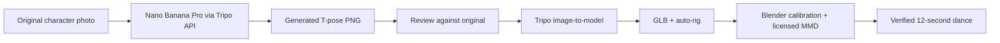

# Original photo → T pose → Tripo 3D / 原图到 T pose 再到 3D

The user supplies one original character photo and a Tripo API key. A posed photo
with a busy room or a held prop is first converted into a clean modeling reference.
The T-pose image is generated inside the workflow; it is not an extra user input.



## 1. Prepare the modeling reference

```sh
# Preview only; no key, upload or credits needed.
cosmmd prepare --image private/photo.jpg --run private/character

# TRIPO_API_KEY must already be set privately.
cosmmd prepare --image private/photo.jpg --run private/character --execute
```

The command uploads the photo and submits one image-editing task to Tripo. It uses
Nano Banana Pro and the T-pose template. The relevant v3 request is:

```http
POST https://openapi.tripo3d.ai/v3/generation/image-to-image
Content-Type: application/json
Authorization: Bearer <TRIPO_API_KEY>
```

```json
{
  "input": "<UPLOADED_FILE_TOKEN>",
  "model": "banana_pro",
  "template": "t_pose",
  "prompt": "Preserve this character's appearance and costume; full-body front T pose, open separated fingers, straight legs, visible shoes, plain neutral background. Remove held props and room clutter.",
  "size": "2K",
  "aspect_ratio": "1:1",
  "output_format": "png"
}
```

Poll the returned task ID. The image is returned in `output.generated_image_url`;
CosMMD downloads and decodes it locally as `t_pose.png`. This is an image-to-image
request, so the original photo is an actual input, not merely described in text.
The [official Tripo v3 reference](https://developers.tripo3d.ai/en/docs/generation-image-to-image)
is the source of these API fields, checked 2026-09-14.

The CLI includes a longer preservation prompt in `cosmmd.tripo.TPOSE_PROMPT`.
For a specific character, provide an editable UTF-8 prompt:

```sh
cosmmd prepare --image private/photo.jpg --run private/character \
  --size 2K --prompt-file private/preservation-prompt.txt --execute
```

Keep facial identity, hair silhouette/accessories, body proportions, garment layers,
trim, cuff ornaments, socks and shoe shape. Specify anatomical sides for asymmetric
costumes. Ask for horizontal arms, straight elbows, open hands with visible finger
gaps, separated straight legs, both soles on the floor, and margin around every limb.
Remove the room and held props when the target is an independently rigged dancer.

The showcased photo contains a parasol, bent limbs and asymmetric socks. Those make
pose preparation useful, but hidden details cannot be recovered with certainty.
Generated completions should be reviewed against every detail visible in the original.

## 2. Review before generating 3D

Open `t_pose.png` beside the original photo. Check:

- Face and hair still match the character; no unintended redesign.
- Both arms extend horizontally; hands, finger gaps and shoes are fully visible.
- The costume's left/right asymmetry is preserved, including socks and sleeve details.
- No parasol, room furniture or fused props are attached to the character.
- No invented garment change, extra fingers, duplicated limb or cropped shoe.

This review can be performed by the agent within its existing authorization; it is
not an unconditional request for another user approval. If the result fails, identify
the defect and adjust the prompt within the user's generation budget. There is no
automatic paid retry or hidden fallback to another image service.

## 3. Feed the T pose into Tripo 3D

```sh
# The input below is the generated T pose, not the original posed room photo.
cosmmd generate --image private/character/t_pose.png --run private/character/model
cosmmd generate --image private/character/t_pose.png --run private/character/model --execute
```

This uploads the reviewed PNG to Tripo and submits image-to-model, then rig-check
and auto-rig. The outputs are `model/source.glb` and `model/rigged.glb`. Continue with
[inspection, calibration, MMD import and rendering](workflow.md#2-inspect-before-repairing).
A T-pose picture improves the starting point; it does not guarantee correct joints,
separate garment meshes, complete hidden anatomy, or MMD-compatible rest axes.

Preparation adds one paid image task to the existing generation/rigging route.
Costs depend on the provider; no balance purchase or automatic regeneration occurs.
If the user already supplies a suitable T pose, start with `generate` directly.

## Checkpoints and publication

`original_input.json`, `tpose_tasks.json` and `tpose_provenance.json` stay in the
private run directory. The provenance includes original/output hashes, prompt,
model, size and task ID. A failed image download resumes the existing task instead
of buying another. An ambiguous POST remains blocked until its task ID is recovered;
a changed photo or changed task parameters require a new run directory.

For a three-stage presentation:

```sh
python -m cosmmd.gif --reference private/photo.jpg \
  --tpose private/character/t_pose.png --frames private/character/frames \
  --output private/character/showcase --fps 15
```

The public example reuses the T pose and 3D model from the existing build; the new
preparation command was tested offline. It is not a claim that the displayed dance
was freshly regenerated by the API. See [the complete provenance](reproducibility.md).

The old [v2 image task documentation](https://docs.tripo3d.ai/image-generation/advanced-image-generation.html)
calls this image model `gemini_3_pro_image_preview` under `model_version`. CosMMD uses
v3's `banana_pro` under `model`; these identifiers must not be interchanged.

## 中文

**你提供原始照片，流程自己生成 T pose，再用 T pose 生成 3D。**

`prepare` 通过 Tripo API 调用 Nano Banana Pro（v3 模型名 `banana_pro`），
使用 `t_pose` 模板和原型保留提示词，生成 `t_pose.png`。它默认只显示计划；
加 `--execute` 才会上传照片并产生一次图片任务。无需额外的 Google API 密钥。

对照原图检查脸、卷发、衣服层次、袖口、鞋型和左右袜子。特别注意：原图里被遮挡
或弯曲的部位可能由模型推测补全，不能把新增细节当成原图事实。姿态图检查完成后，
把 `t_pose.png` 传给 `generate`，得到 3D GLB 与自动绑定模型，再进入 Blender 校准和舞蹈导入。

两个命令分别保存任务记录。下载中断不会触发重新付费生成；请求超时且结果不明时，
先找回原任务 ID。原图、提示词、任务记录和模型都保存在本地；公开展示需单独审核。
本次 README 中的 T pose 和舞蹈沿用现有案例，新增 API 步骤已做离线测试。
