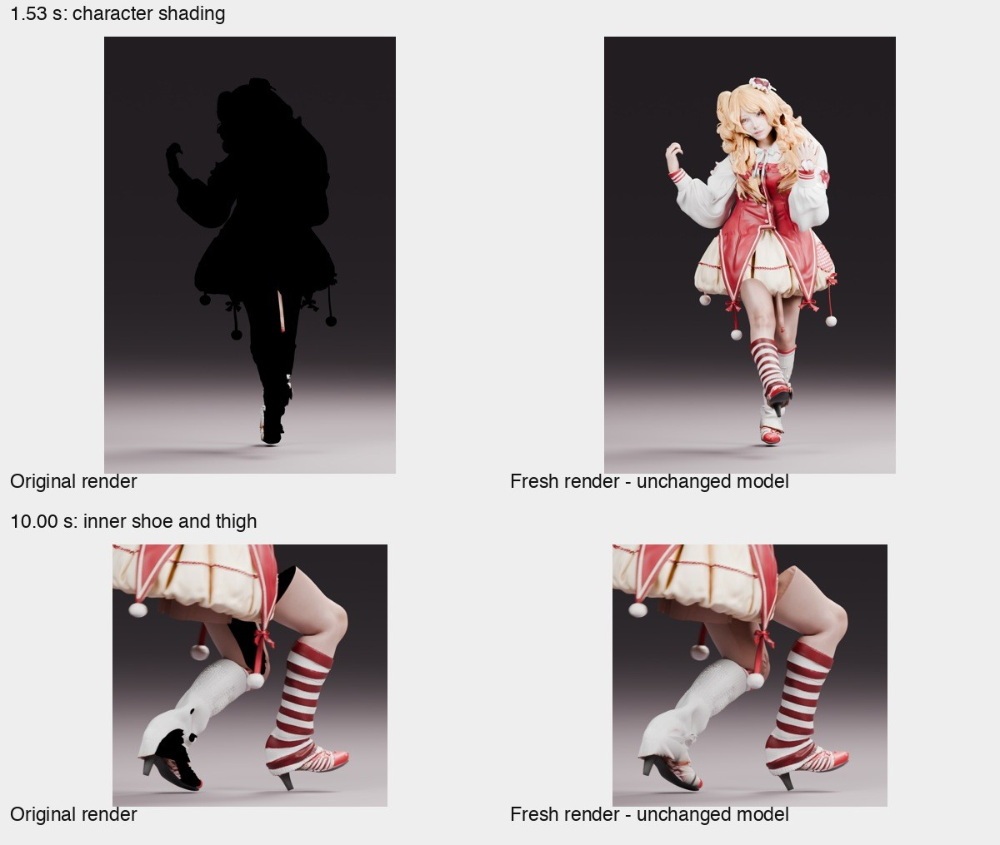

# Failure notebook / 踩坑记录

These observations come from one real character-building session. Each entry records
what failed, what evidence changed our decision, and what a later run should verify.

| Pitfall / 问题 | Evidence and fix / 证据与改法 |
|---|---|
| A prepared T pose was mislabeled as the original input / 把 T pose 中间图当成原图 | Keep original photo, prepared T pose and 3D output distinct. The owner supplied the actual posed photo; update the showcase and retain preparation provenance. |
| Image preparation can change identity / 姿态整理可能改变原型 | Remove scene clutter and held props, then compare face, curls, cuffs, asymmetric socks, shoes and visible trim. Occluded details are inferred; a successful image API task is not likeness validation. |
| Nano Banana Pro API names differ / 模型名随 API 版本不同 | v3 image-to-image uses `model: banana_pro` and `template: t_pose`; the legacy v2 task uses `model_version: gemini_3_pro_image_preview`. Do not mix schemas or invent a text-only generation path for a photo edit. |
| Studio is not the API task namespace / 网页模型 ID 不等于 API 任务 ID | A known Studio asset returned 404 from the API. Use an explicit GLB export/re-upload path; do not guess endpoints, enumerate private tasks or spend credits regenerating without approval. |
| Credits differ / 余额误解 | Studio and API access/billing did not behave interchangeably. Confirm the chosen service and record task IDs; the adapter does not promise a fixed cost. |
| A successful auto-rig is only a starting point / 自动绑定成功不等于能跳舞 | Source shoulders, wrists and feet were anatomically misplaced. Inspect actual bones inside the original surface. |
| Left/right and knee folding / 左右腿与膝盖反折 | Fit hip/knee/ankle positions to the character, verify weight ownership, set the correct hinge axis and limits, and test one leg at a time. |
| Pole controls were unstable / 极向控制不稳定 | A local-axis hinge and preferred bend worked better for this case. A 10° seed still failed some poses; 25° worked. Recheck after VMD import overwrites calf channels. |
| Reach error was misclassified / 不可达动作目标 | Compare target distance with maximum leg reach and minimum reach imposed by the knee limit. Keep raw error and excess-over-reach error separate. |
| Elbows and wrists were guessed / 肘腕位置错误 | Match shoulder, elbow and wrist to actual anatomy, including twist-bone parenting and sleeve weights. |
| Finger fusion was inferred from one view / 误判手指粘连 | The high-resolution source had finger gaps and distinct fingertips. Multi-view close-ups and topology disproved the initial claim. |
| Rebuilding hands/shoes damaged identity / 重建破坏原型 | Simplified replacements lost nails, palm shape, cuff ornaments, heel shape and sock wrinkles. The successful revision restored original high-resolution surfaces and UVs, then changed weights. |
| A surface model lacks hidden anatomy / 穿衣模型没有完整裙内身体 | Some inner legs were joined; hidden upper thighs were missing. Separate the actual fused region and fill only missing interiors. |
| Skirt weights leaked into legs / 裙摆被腿拉走 | Remove inappropriate thigh/calf influence from the skirt shell; preserve skirt/pelvis weights. Large-lift intersections still remain without more geometry/physics work. |
| Finger roots became jagged / 指根变形 | Smooth weights over neighboring vertices and keep cuff ornaments with the wrist. Do not blur weights across finger gaps. Test each finger's effect on neighboring tips. |
| MMD T/A pose mismatch / 初始姿势不兼容 | Relative rotations assume a rest basis. Calibrate mesh and bone rest pose together before importing motion. |
| Add-on-dependent IK paths / 工程依赖插件 | Convert IK-toggle animation paths and constraint drivers to native custom properties; reopen a copy without the add-on and verify. |
| Render cache/state artifacts / 渲染黑块 | Original video frames 41–56 (1.33–1.87 s) had a black character, while the background rendered normally. PNG masters had the same defect. Identical settings and geometry rendered correctly after reloading the scene. |
| Shoe black patches were misdiagnosed / 鞋内黑色不是普通阴影 | Inner shoe and thigh patches also disappeared in a fresh render without mesh edits. Cache/material-update failure is suspected; precise renderer internals remain unproven. |
| Four sample frames missed a defect / 只抽查四帧不够 | The 16-frame silhouette interval was missed. Scan every frame, inspect complete contact sheets, then inspect actual encoded playback. |
| Color transformed twice / 合成时重复调色 | PNG masters already contain the display transform; use Standard/None when assembling them through Blender VSE. |
| Large Blender files can leak motion / 工程也有版权内容 | Baked actions, derived JSON curves and scene backups still redistribute motion. Exclude them just like VMD, not only the original ZIP. |
| Blender can exit successfully after a Python exception / 脚本异常未反映到进程状态 | Pass `--python-exit-code 1`, verify expected output files and inspect logs; do not trust return code alone without configuring it. |
| Add-on dependencies differ from host Python / 插件依赖环境不同 | Blender uses bundled Python and may ignore host PYTHONPATH; explicitly provide an external dependency directory for OpenCC when using a source checkout. |
| A valid output file is not completion / 有文件不等于完成 | Verify timing, count, decode, visual content and remaining defects. Report limitations instead of labeling the whole character “fixed.” |

## What remains

Hair may stretch locally. Skirt/thigh intersections remain in large lifts. Interior
repairs are less detailed than the untouched outer surface. No facial morphs, lip sync,
audio or cloth physics is implemented in the showcase. PMX export is not verified.
The open-source tools make these problems inspectable; they do not make them disappear.

## 中文总结

优先修绑定，保留原手、鞋和服装。只有证据确认缺面或连接错误时才局部修改网格。
动画验证覆盖全程，渲染验证覆盖每帧。纯黑块先做“同模型、同参数、重新载入”的对照，
不要把渲染状态异常误判成模型洞口。把限制写进交付说明，比宣称完美更有利于继续迭代。
