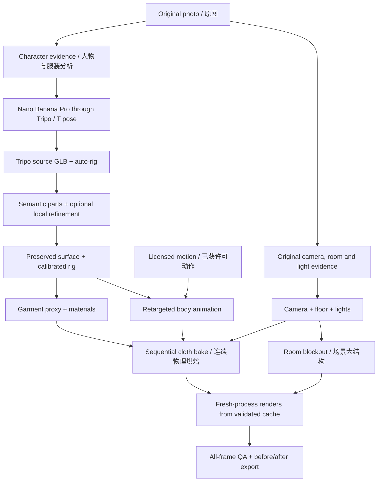

# Reusable technical roadmap / 可复用技术路线

Status: **design proposal, 2026-09-14**. This document specifies the next implementation
stages; it does not claim that cloth simulation, photo-matched lighting, room
reconstruction or a generic job runner already exist. See [current evidence](reproducibility.md).

## 目标与边界 / Goal and scope

角色输入保持为 **一张原始照片 + Tripo API 凭证**。舞蹈来自已有许可的独立动作资源。
默认在 Mac 上运行：Python 编排，Tripo 生成角色，Blender 完成几何、物理和渲染。
不增加必需的付费服务。人物背面、遮挡处、衣服内部、房间尺寸和灯光都可能需要推断；
记录推断和人工校准，不把单图近似还原描述成测量得到的真实场景。

优先级：建立可比较的灯光基准 → 布料材质 → 裙摆物理 → 场景大结构 → 装饰细节。
完整场景依赖角色与物理稳定，但相机、地面、主光应提前确定。
在迁移角色和计算布料前，先通过 [分件路线与脸部对齐检查](part-pipeline.md)：
以完整角色约束比例，分件共享骨架，局部生成作为可选增强，保留已有舞蹈基准。



**两条分支始终读取正确的图：** 角色建模使用经过审核的 T pose；相机、环境和灯光读取原图。
Nano Banana Pro 改变了姿势与背景，原图上的像素坐标不能直接当成 T pose 或 3D 网格坐标。

## 技术栈与阶段契约 / Stack and stage contracts

下表的输出名是规划中的运行产物，除已有 CLI 外，不表示存在同名命令。
所有角色数据、贴图、缓存、工程和含动作文件放在被忽略的 `private/<run>/` 中。

| 阶段 / Stage | 技术选择 / Stack | 输入 → 输出 | 验收与自动化边界 |
|---|---|---|---|
| 0. 建立任务 | 现有 Python CLI；后续增加 dataclasses、版本化 JSON 契约 | 原图、动作引用、默认配置 → `job.json`、输入哈希 | 单位、帧率、原图朝向统一；凭证只通过环境读取 |
| 1. 分析图片 | Pillow、NumPy；可选 OpenCV；可选 SAM 2.1 | 原图 → 人物/衣服/环境蒙版、服装区域标签、关键线段 | agent 或人工检查标签、伞和袖子的边界；不把蒙版当完整衣服拓扑 |
| 2. 生成 T pose | 已有 `cosmmd prepare`，Tripo v3 / Nano Banana Pro | 原图 → `t_pose.png`、任务来源记录 | 对照脸、衣服左右差异、手、鞋和遮挡推断；已有 API 适配器，尚非新端到端实测 |
| 3. 生成初始 3D | 已有 `cosmmd generate`，Tripo image-to-model / rig-check / rig | 审核过的 T pose → 原始与绑定 GLB | 保留源模型；API 任务断点恢复；失败不盲目重复付费 |
| 4. 几何与骨骼 | Blender `bpy`、`bmesh`、`mathutils`、现有 rig helpers | GLB → 校准骨架、原表面、服装面集、身体碰撞代理 | 左右腿、膝肘、手指、鞋和 UV；通用工具已有，关节拟合仍需角色配置 |
| 5. 相机与灯光基准 | Blender Camera、Area Light、World、Cycles；可选 fSpy / OpenCV 线段辅助 | 原图、场景线索 → `camera.json`、`lighting.json`、地面 | 透视、主光方向、阴影软硬、曝光；相机配准和灯光拟合属于待实现模块 |
| 6. 衣服视觉 | Blender Principled BSDF、节点组、保留原 UV；局部厚度处理 | 原服装表面、区域标签 → 材质实例、局部内衬 | 中性灯光与目标灯光下都检查；花纹、轮廓和原鞋保持可比 |
| 7. 衣服物理 | Blender Cloth、Pin Group、Collision、Surface Deform | 简化服装网格、身体动作、碰撞代理 → 烘焙缓存、细节表面变形 | 先裙摆；检查体积、穿插、接缝、配饰和双重变形；待实现 |
| 8. 动作驱动 | 外部 MMD Tools + 现有导入/验证脚本 | 已许可 VMD、骨骼映射 → 原生 Blender 动作 | 延续独立腿/手指测试；先修身体运动，再计算衣服物理 |
| 9. 场景还原 | Blender 参数化基础几何；需要重复物件时用 Geometry Nodes；可选单目深度 | 原图、相机 → 房间大结构、必要贴图、装饰实例 | 固定机位先检查透视、遮挡和舞蹈活动空间，再做多角度可见面 |
| 10. 烘焙与渲染 | Blender 连续烘焙；现有独立进程 Cycles 渲染；Mac 使用已验证的 Metal 路径 | 固定版本场景 + 有效缓存 → PNG 序列 | 新进程随机读取缓存与顺序播放结果一致；缓存失效不能静默跳过 |
| 11. 验收与展示 | NumPy、Pillow、Blender 几何检查；已有 GIF 工具；可选 FFmpeg 编码 MP4 | PNG 与报告 → 对比图、12 秒 GIF/视频 | 全帧检查、近景检查、解码检查；发布继续执行现有索引/历史审核 |

已有命令详见 [workflow](workflow.md) 和 [photo → T pose](photo-to-tpose.md)。
阶段 5 的基准应先落地，阶段 7 的烘焙必须等阶段 8 的身体动作确定。

## 衣服：显示表面与模拟表面分开

1. **分区。** 先从实际 GLB 的材质、连通性、投影视图和人工标记建立服装面集。
   对 T pose/模型正交渲染图分别做分割，再通过深度可见性和多视图一致性提出 3D 面标签。
   原图分割仅提供语义线索。任何粘连、隐藏表面缺失，都要先定位再局部修复。
2. **保留显示表面。** 原外表面、UV、花纹和配饰是对照基准。分离对象时保存源面/顶点映射；
   原始源副本不变。需要新建的是模拟代理、内衬或实际缺失的区域。
3. **生成模拟代理。** 从服装面集得到低密度、边长相对均匀的代理网格，保留裙腰和主要轮廓。
   开放的裙摆允许边界；修复非流形分叉、自交、重叠点和退化面。代理尺寸/拓扑变化要重新绑定。
4. **按结构设置行为。** 上身与腰部保持较强约束；裙摆允许摆动；袖口、蝴蝶结、绒球使用独立附件规则。
   蓬裙先以支撑代理/内衬碰撞维持体积，再调整弯曲刚度。不要把开放裙子直接当密闭气囊使用压力。
5. **绑定与碰撞。** 推荐起点是代理 `Armature → Cloth`，衣腰顶点组固定到动画姿态。
   身体碰撞器需要随骨架变形，补齐实际需要的隐藏大腿/臀部区域；碰撞厚度按角色米制尺寸设置。
   仅模拟可见需要的部位，按结果启用自碰撞和提高求解质量。
6. **驱动细节。** 通过 Surface Deform 将代理运动传到原服装表面；代理与显示网格在明确的共同静止帧绑定。
   已由代理完整驱动的区域避免再叠加一遍骨骼运动；混合边界、附件与接缝需独立动作验证。

Blender 官方将简化布料代理驱动细节网格列为
[Surface Deform 的典型用途](https://docs.blender.org/manual/en/latest/modeling/modifiers/deform/surface_deform.html)。
这是技术选型依据；CosMMD 的具体绑定、碰撞和厚度参数仍需实测。

材质与动力学使用不同配置。保留 base color，按区域设置 roughness、sheen 和细微 bump；
避免把原贴图中烘入的阴影再做成粗糙度。Sheen 适合表现表面细纤维，但一张图不能测出真实物性。
参见 [Principled BSDF](https://docs.blender.org/manual/en/latest/render/shader_nodes/shader/principled.html)。

先为当前蓬裙建立一个具体配置，再抽出 `structured_skirt`、`loose_skirt`、`fitted_top`
等预设。数值只是起点，必须随尺寸、网格密度、动作速度和材质结构校准。

## 场景与灯光：先约束相机，再拟合外观

- **相机。** 从窗框、墙角、地板等直线给出消失方向。可由 fSpy 辅助校准，或保存线段交给
  Python/Blender 求解。镜头参数、地平线和尺寸假设写入配置；缺少已知尺寸时采用明确标记的尺度假设。
  [fSpy](https://fspy.io/basics/) 根据控制点估计相机参数，需要可辨认的几何线索。
  在本项目 Blender 版本中先检查导入器兼容性；也可仅保存估计参数而不依赖导入插件。
- **地面与灯光。** 先放地面、墙和少量面积光；依据可见高光、阴影、暖冷关系提出初始值。
  固定颜色管理和曝光后，逐项调整方向、尺寸、强度及颜色，避免用灯光去抵消错误材质。
  原图亮部过曝、遮挡和反射会造成歧义，因此目标是可信的视觉匹配。
- **比较方式。** 原图人物是摆拍姿势，不能把跳舞帧和原图做整图像素拟合。
  场景用遮去人物的线段/区域检查；角色用统一姿势、固定机位的材质和阴影对照。
  可选 OpenCV 色彩/边缘指标辅助排序，最终保留人工视觉判断。
- **场景第一版。** 参数化墙、地板、窗、椅子和灯具，恢复构图、配色、遮挡、接触阴影。
  相机投影贴图只用于可见区域；原图人物和已存在的阴影要屏蔽或重绘，避免出现重复人物/阴影。
  被人物挡住的位置用简单材质/几何补全，并记录为推断。
- **场景第二版。** 增加椅背、窗帘、重复装饰等细节，再开放镜头小幅移动。
  大幅环绕需要补全照片看不见的面，属于更高成本目标。生成整房间不是首版的必经步骤。

单目深度可辅助判断前后关系。可选
[Depth Anything V2 Small](https://github.com/DepthAnything/Depth-Anything-V2)，其 Small 权重使用 Apache-2.0；
其他规模的权重许可不同。相对深度不等于可靠的米制测量，更不提供被遮挡的完整房间。

## Mac 与依赖分层

| 层 | 选择 | 项目约束 |
|---|---|---|
| 核心编排 | Python 3.10+、现有 NumPy/Pillow、标准库 JSON/subprocess | 保持现有安装可用；新增 job runner 使用显式版本契约 |
| DCC worker | 固定验证过的 Blender 5.2.1，使用其自带 Python | 不将整个机器学习环境安装进 Blender；版本升级跑代表性场景回归 |
| 可选视觉 | OpenCV；独立环境中的 SAM 2.1 / Depth Anything V2 Small | 单独记录依赖锁、权重哈希、许可证与设备；先测本机耗时/内存，失败保留人工标注路径 |
| 生成服务 | Tripo API，复用现有适配器 | 不增加必需 API 凭证；额外的图像重试或场景生成单独计费与记录 |
| 渲染与编码 | Cycles Metal / CPU；Pillow GIF；可选 FFmpeg | 先做本机小样；物理性能单独测量，不能从 GPU 渲染性能推断 |

[SAM 2](https://github.com/facebookresearch/sam2) 提供可提示的图像分割，需额外 PyTorch/权重；
它不会自动给出正确的服装语义、纸样或可模拟 3D 衣服。其 CUDA 示例不能直接当作 Mac 的部署验证。
首版可通过可编辑蒙版/面集完成相同契约，不让可选模型阻塞主流程。

## 可维护的接口与恢复 / Reuse and recovery

规划中增加 `analysis`、`scene`、`garments`、`simulation`、`evaluation` 模块，
继续复用现有 Tripo、rig、render 和发布工具；先实现垂直样例，再抽公共接口。
Skill 保存选型、检查和修复决策，repo 保存确定性代码与契约；配置不依赖某个 agent 的聊天记忆。

建议的 `job.json` 核心字段如下，**这是契约草案，当前 CLI 尚不读取它**。
所有路径相对私有运行目录解析；凭证值不写入任务配置。

```json
{
  "schema_version": 1,
  "inputs": {"photo": "inputs/original.jpg", "motion": "inputs/licensed-motion.vmd"},
  "units": {"length": "meter", "up_axis": "Z", "anatomical_sides": true},
  "character": {"profile": "character.json", "source_surface_policy": "preserve"},
  "camera": {"profile": "camera.json", "mode": "fixed"},
  "lighting": {"profile": "lighting.json", "fit": "assisted"},
  "garments": {"profile": "garments.json", "first_region": "skirt"},
  "animation": {"source_fps": 30, "start": 301, "end": 660},
  "simulation": {"fps": 30, "bake_end": 660, "preroll_policy": "validated"},
  "render": {"sample_step": 2, "size": 720, "device": "METAL"},
  "export": {"duration_seconds": 12, "gif_fps": 15}
}
```

这些帧号与尺寸来自现有样例，其他动作和角色应使用自己的配置。建立明确的原动作时间映射：
展示帧段并非物理起点；预滚区间、起始姿态和过渡曲线由运行报告保存。

每个阶段产出：输入/输出哈希、参数版本、工具版本、完成状态、人工修正、视觉证据和耗时。
建议状态为 `planned → running → needs_review → complete`，另有 `failed`；沿用付费 POST 的
`pending_or_unknown` 处理。输出先写临时文件，验证后发布到本次运行；同一阶段使用运行锁。
不将模型训练或大批量自动重试作为默认流程。

新增布料后，缓存契约是实现的第一项必要工作：

- **连续计算。** 先在一个 Blender 进程中预滚并逐帧烘焙，物理按动作帧率计算。
  12 秒/30 fps 的展示涉及 360 个时间步，GIF 可只取 180 帧；不能只模拟奇数帧。
  预滚从可用姿态平滑进入展示起点；不能在第 301 帧从静止布料直接跳入运动。
- **独立读取。** 缓存放在私有运行目录，用已验证的磁盘缓存路径保存并在新进程重新载入。
  正式出片前比较顺序播放与全新进程读取若干非连续帧的网格位置。失败就修复/重烘焙，不发布未缓存模拟。
- **失效传播。** 动作、代理拓扑、绑定、碰撞器、求解参数、帧率、Blender 版本变化都使布料缓存失效。
  相机/纯灯光变化只影响渲染；物理碰撞物位置变化影响模拟。材质修改仅在不改变几何时不影响物理。
- **扩展现有渲染签名。** 当前签名包含 `.blend` 和部分渲染设置，尚未覆盖外部缓存/贴图。
  加入依赖清单及内容哈希后再支持布料断点恢复，避免引用旧缓存得到错误的“已完成”帧。

Blender 的 [cloth cache 文档](https://docs.blender.org/manual/en/latest/physics/cloth/settings/cache.html)
说明几何变化后需要清除缓存，模拟相关细分级别也应在预览/渲染间一致。
跨进程读缓存是本项目需要实测的新条件，尚未被当前无布料演示验证。

## 里程碑与验收 / Milestones and acceptance

| 顺序 | 可交付成果 | 通过条件 |
|---|---|---|
| M0. 可比基准 | 原版本归档、相机/灯光配置、固定姿态对比页、运行清单 | 同一角色/动作/相机/颜色管理下可复现基准；清楚区分原始与推断信息 |
| M0a. 分件与脸部 | 候选模型分组、五官对齐诊断、与旧表面/骨架的对应 | 分件适合实际服装结构；脸部几何与外观一致；迁移无无关细节损失 |
| M1. 布料外观 | 分区标签、材质预设、局部内衬和近景对比 | 衣服印花/鞋/脸无无关改动；中性灯光与目标灯光下均无明显新缺陷 |
| M2. 裙摆物理 | 单一裙摆代理、碰撞器、连续缓存、同一段 12 秒对比 | 新进程读缓存一致；无模拟爆炸；裙型保持；大抬腿/转身穿插较基准减少 |
| M3. 场景还原 | 原图相机、房间大结构、灯光与角色合成 | 原图线段/遮挡匹配合理；脚底接触可信；人物不重复；舞蹈不撞进布景 |
| M4. 跨角色复用 | 第二、第三个有权使用的单图案例；参数化配置；失败报告 | 换角色无需修改核心源代码；记录校准时间、生成成本、内存与失败类别 |

M2 的几何检查包括身体/裙面三角形相交、闭合碰撞器的内外判断、边长变化、
腰部约束漂移以及非有限坐标。BVH 最近距离本身不能证明没有穿插。
指标与阈值按米制尺度和具体角色配置；它们负责定位可疑帧，不能取代可见表面的视觉验收。
显示表面的保持情况在相同静止姿态比较坐标、源映射、UV 和贴图哈希；动画中的自然变形另行检查。

基准报告包括所有展示帧和危险姿态近景；在固定镜头下比较材质、衣服运动、穿插与脚底接触。
重新检查先前的黑帧区间，并实际解码最终 GIF/视频。不能用全图平均指标掩盖局部手/鞋/裙子问题。

公开代码与配置模板；保留模型、动作、贴图、物理缓存及含动作工程在本地。
未来实现缓存模块时补齐扩展名/内容审核，沿用当前 `.gitignore` 与 Git 索引/历史审核。
只有通过验收的能力才能从 roadmap 移入 README 的“已经提供”。

## English implementation brief

Keep the required stack **Python + Tripo API + Blender**. Branch from the original
photo: the character branch prepares a reviewed T pose, while camera/room/light
analysis keeps the original image. Optional segmentation and relative-depth models
provide proposals; they do not recover garment patterns, metric rooms or hidden anatomy.
Use the [part-pipeline decision](part-pipeline.md) before changing the source character:
retain a whole-character anchor and one rig, inspect face alignment, and treat independent
regional generation as an optional refinement rather than the default assembly strategy.

Preserve the detailed garment and its UVs. Build a separate cloth proxy, rig its
attachment region, add animated collision geometry and drive the original surface
with Surface Deform. Start with the skirt and retain structural support for its volume.
Treat material appearance and physical behavior as separate configuration profiles.

Match the camera and establish floor/lighting early. Add room blockout after the
garment result is stable. A fixed-camera reconstruction can use visible geometry and
reviewed projections; new viewpoints require inferred geometry behind occlusions.

Bake simulation sequentially at the motion rate before fresh-process rendering.
Extend render resume signatures to include external cache/texture hashes. Verify
random-frame cache reads against sequential evaluation before using them for export.
Run manifests record versions, units, coordinate conversions, assumptions, overrides,
cost, timing and evidence. No new stage commands or job runner are shipped by this document.

Deliver in order: reproducible baseline, cloth appearance, skirt physics, room/light
integration, then two additional single-photo cases that need profile changes rather
than core-code edits. Validate silhouettes, local intersections, attachments, original
surface preservation and the final encoded clip. Keep private source/animation/cache
assets out of Git and update the companion skill when each implementation is verified.
